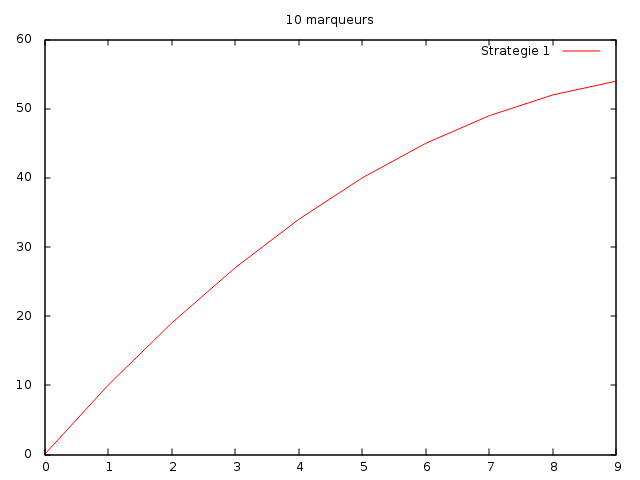
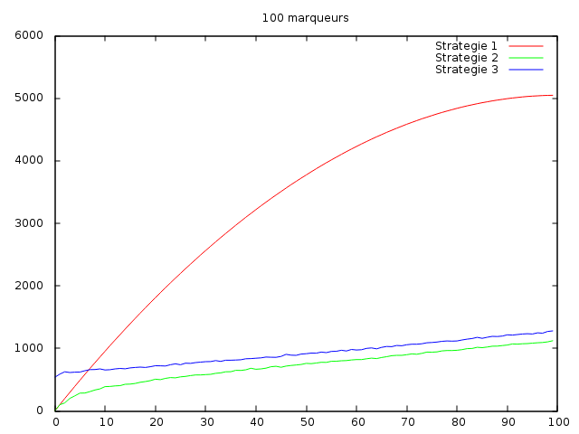

-------
Answers
-------

=============
Stratégie 1 :
=============

Question 2 :
============

Nous compterons les comparaisons entre deux éléments, fait par notre apelle a la fonction compcpt.

Question 3 :
============

Pour n marqueurs et p positifs deja fixé, quelque soit le cas le resultat restera le meme.

Question 4 :
============

c(m,p) = (m-p)*p + (p*(p+1))/2  (dans tout les cas)

=============
Stratégie 2 :
=============

Question 2 :
============

L'utilisation d'une recherche dichotomique sur les positifs, comme nous recherchons tout les positifs le nombre de comparaisons sera toujours le même

Une borne supérieur pour c2(m,p) est c2(m,p) = p * log(p) + m * log(p)

=============
Stratégie 3 :
=============

Question 2 :
============

Il n'y a pas de pire ou meilleure des cas car nos deux listes sont triées, de plus nous gardons l'indice du dernier marqueurs positfs trouvés

Une borne supérieur pour c3(m,p) est c3(m,p) = p * log(p) + m * log(p)

Conclusion :
============

On voit que pour une liste de petite taille la stratégie 3 est la plus couteuse et la stratégie 1 la moins couteuse.

Tandis que pour des listes de grandes tailles la stratégie 1 est la plus couteuse et la stratégie 2 la moins couteuse

On peut constater le fait de trier peut nous couter plus cher que la recherche en elle même il faut donc trouver le juste milieux

